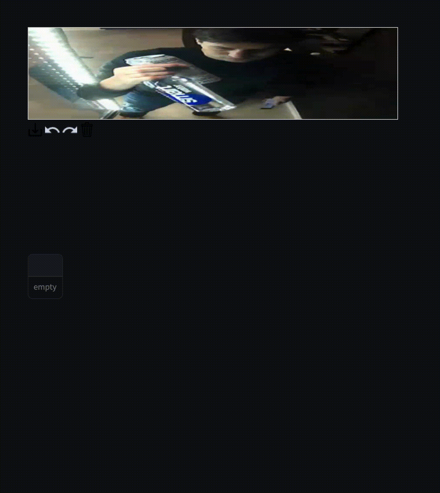

# Herramienta de Anotación de Imágenes para Machine Learning 🖼️

### Objetivo

Desarrollar una API para anotar imágenes, similar a una herramienta de etiquetado de imágenes. La aplicación debe permitir a los Data Operators (usuarios) iniciar sesión, seleccionar y anotar imágenes, y guardar estas anotaciones con sus metadatos en una base de datos.

*Recuerda que esta aplicación busca funcionalidad, eficiencia y seguridad.*

### Requisitos Técnicos 🔩
1. Framework y Lenguaje 🧑🏻‍💻
* Lenguaje de Programación: Python, Elixir or Go.
2. Autenticación de Usuarios 🔐
* La aplicación debe manejar usuarios y contraseñas.
* Los detalles de los usuarios deben almacenarse en una base de datos segura.
3. Almacenamiento de Imágenes 🖼️
  Puedes encontrar imagenes para test en este repositorio en /images
* Las imágenes pueden almacenarse local o un servicio externo (opcional).
* La aplicación debe permitir cargar y recuperar imágenes desde la fuente con rapidez.
4. Base de Datos 💾
* Almacenar la información de las coordenadas y texto de las anotaciones en una base de datos.
* La estructura de la base de datos debe ser diseñada para optimizar la recuperación y el almacenamiento de datos de anotaciones.
5. Rest API
* Diseñar e implementar todos los endpoints que necesitaria el frontend (todos los que consideres necesarios)
* Como minimo tiene que tener un crear, actualizar, listar (con paginador) y buscar por id.

### Criterios de Evaluación 📝

* Funcionalidad: La aplicación debe cumplir con todos los requisitos mencionados.
* Diseño de la Base de Datos: Eficacia en el manejo de datos de usuarios e imágenes.
* Calidad del Código: Claridad, mantenibilidad y uso de buenas prácticas de programación.
* Seguridad: Implementación de medidas de seguridad para proteger datos sensibles.

### Entrega del Proyecto 📤

El código fuente debe ser entregado en un repositorio diferente (compartir link)
Incluir un README detallado con instrucciones para configurar y ejecutar la aplicación.
Documentar el diseño de la base de datos y cualquier decisión importante de arquitectura.

### Extras son bien recibidos 🎁

Implementación con Docker

Como un desafío adicional, te animamos a contenerizar tu aplicación utilizando Docker. Esta implementación no solo demostrará tus habilidades en la gestión de contenedores y orquestación, sino que también añadirá un nivel de profesionalismo y escalabilidad a tu proyecto.

### Requisitos para el Desafío extra

1. **Contenerización con Docker:**
   - Crea un `Dockerfile` para contenerizar tu aplicación.
   - Asegúrate de que la aplicación se ejecute correctamente en un entorno de contenedor local.

3. **Documentación:**
   - Incluye instrucciones detalladas en tu `README.md` sobre cómo construir la imagen de Docker.
   - Proporciona guías de configuración y cualquier script necesario para facilitar el despliegue.

### Criterios de Evaluación del Desafío extra

- **Correcta Implementación de Docker:** La aplicación debe estar correctamente contenerizada y funcionar en un entorno de Docker.
- **Calidad de la Documentación:** Claridad y precisión en las instrucciones y configuración.

Este desafío extra es una oportunidad para demostrar habilidades avanzadas en desarrollo moderno. ¡Esperamos ver tu solución!

---

### Propuesta Base de datos

### Estructura básica de la Base de Datos. Proponer e implementar mejoras.

### Tabla `Usuarios`
- `id_usuario`: INT, PRIMARY KEY, AUTO_INCREMENT
- `nombre_usuario`: VARCHAR(255)
- `correo_electronico`: VARCHAR(255)
- `contrasena_hash`: VARCHAR(255)

### Tabla `Imagenes`
- `id_imagen`: INT, PRIMARY KEY, AUTO_INCREMENT
- `url_imagen`: VARCHAR(255)
- `nombre_imagen`: VARCHAR(255)
- `ubicacion_s3`: VARCHAR(255)

### Tabla `Anotaciones`
- `id_anotacion`: INT, PRIMARY KEY, AUTO_INCREMENT
- `id_usuario`: INT, FOREIGN KEY (referencia `Usuarios.id_usuario`)
- `id_imagen`: INT, FOREIGN KEY (referencia `Imagenes.id_imagen`)
- `coordenadas_xy`: JSONB
- `texto_anotacion`: TEXT
- `fecha_hora`: DATETIME


## Diagrama Tentativo de la Base de Datos. Proponer e implementar mejoras.

```plaintext
+----------------+     +----------------+     +----------------+
|    Usuarios    |     |    Imagenes    |     |   Anotaciones  |
+----------------+     +----------------+     +----------------+
| id_usuario     |<-+  | id_imagen      |<-+  | id_anotacion   |
| nombre_usuario |  |  | url_imagen     |  |  | id_usuario     |
| correo_electr. |  |  | nombre_imagen  |  |  | id_imagen      |
| contrasena_hash|  |  | ubicacion_s3   |  |  | coordenada_x   |
+----------------+  |  +----------------+  |  | coordenada_y   |
                     +---------------------+  | texto_anotacion|
                                              | fecha_hora     |
                                              +----------------+
```

## Ejemplo. Solo a modo de ilustración y guía. La aplicación en el ejemplo no está terminada.


